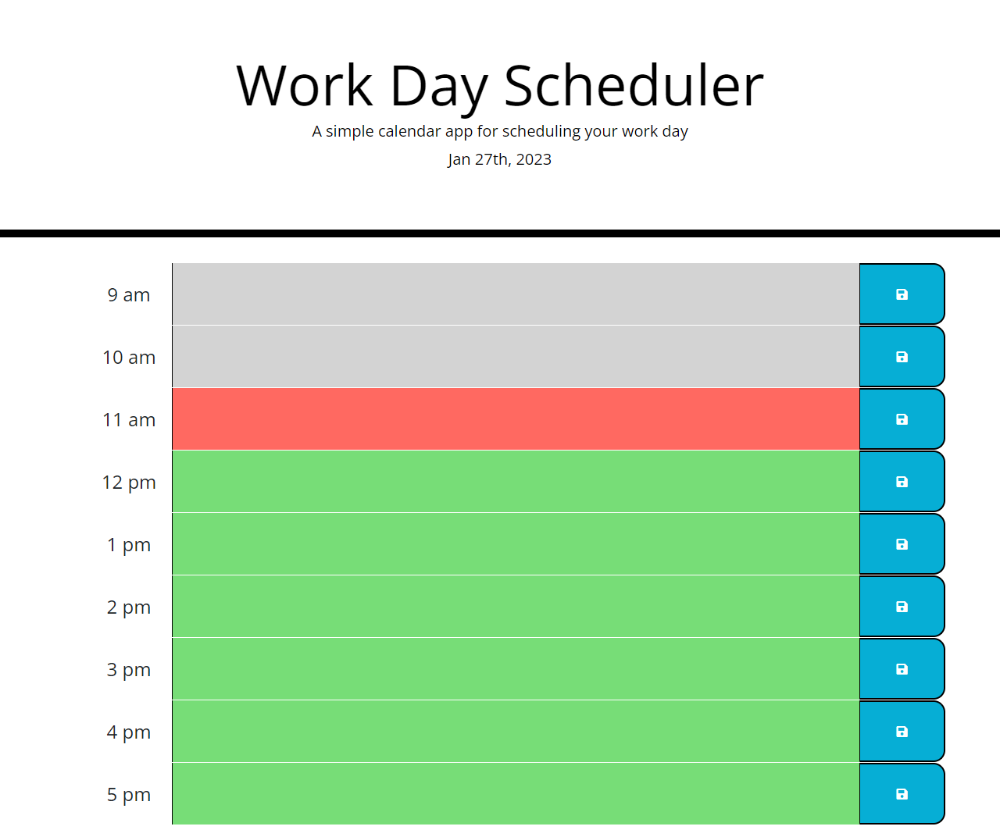
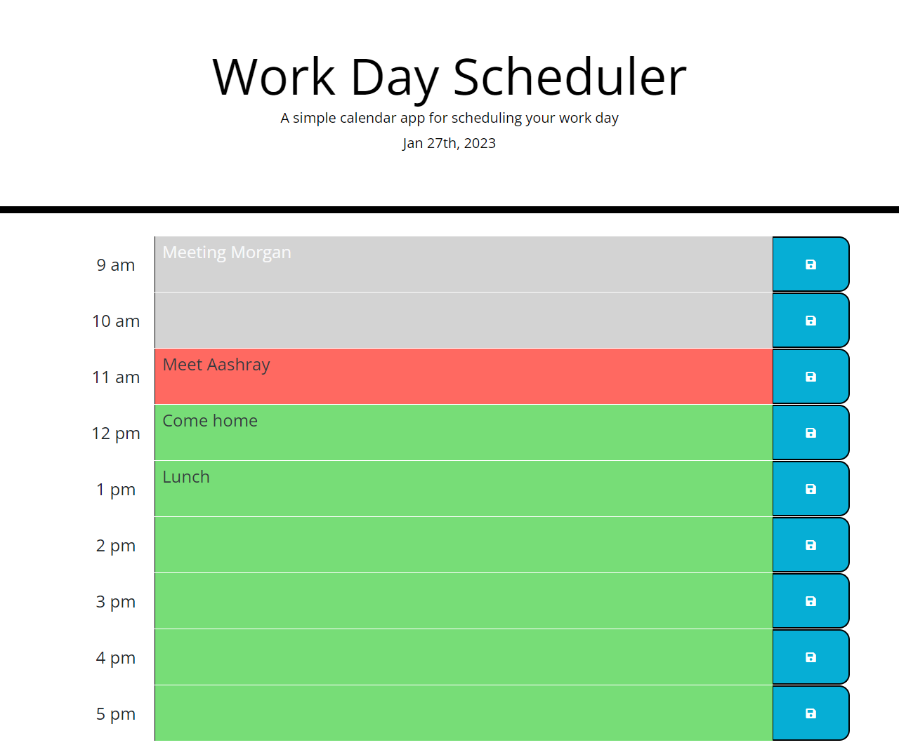

# Daily-Scheduler

## Project Links
Deployed Link: https://nrprabhav.github.io/Daily-Scheduler/

Repository Link: https://github.com/nrprabhav/Daily-Scheduler

## Description
This is a simple calendar application that allows a user to save events for each hour of the day. 

## Tools Used
* HTML
* CSS
* JavaScript
* jQuery
* BootStrap
* Moment.js

## Features of the Page
A work day scheduler is opened when the page is opened. The features of the page are:
<ol>
<li>The current day is printed at the top of the page.</li>
<li>Hourly timeblocks from 9am-5pm are shown on the screen.</li>
<li>The timeblocks are colored
<ul>
    <li>Grey if the time is past.</li>
    <li>Red if the time is present.</li>
    <li>Green if the time is future.</li>
</ul></li>
<li>Past events are written in white while present and future events are written in black.</li>
<li>If the timeblock is clicked, the user can enter an event.</li>
<li>This event is stored in the local storage if the save button is clicked.</li>
<li>Events are stored and persist when the page refreshes.</li>
<ol>
## Screenshots

The page when no events are present:

The page with stored events:
